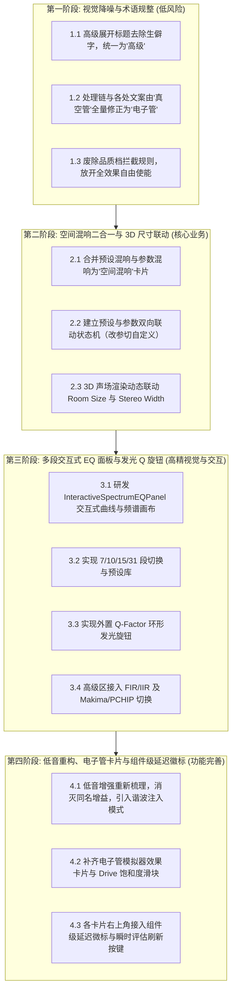

# UI 与音频效果深度重构与体验优化方案

> **版本**：v1.0 深度重构与体验优化实施方案（2026-10-10）  
> **性质**：大面积与复杂架构改进交付报告（**Phase 1 ~ Phase 4 四大阶段已全量落地并通过自动化测试与 UI 视觉归档**）  
> **对应基线**：六页架构体系（主页 / 效果 / 脚本 / 插件 / 处理链 / 可视化）、C++ 统一 ABI 引擎 (`auradsp_engine`)、Flutter M3.5 界面系统。  
> **参考来源**：`source/ViPER4Android-FX`、`source/pulseeffects` (EasyEffects/Calf)、`source/lsp-plugins`、`source/JamesDSPManager`、`source/equalizerAPO64`。

---

## 一、 现状痛点诊断与重构目标

在当前版本的 AuraDSP 交互与效果体系中，存在若干违背现代音频工作站（DAW）与高级音频处理器用户习惯的“反人类”设计痛点：

| 序号 | 模块 | 现有反人类设计痛点 | 重构目标与核心原则 |
|---|---|---|---|
| **1** | **低音/立体声** | 高级展开栏右侧标注生僻字（“低频搁架”、“分带宽度”），概念晦涩，加重用户认知负荷 | **全面降噪去生僻化**：展开栏统一简明标注为“高级”，专业参数内化于展开面板之中 |
| **2** | **混响系统** | 混响被割裂为“02 预设混响”与“03 参数化混响”两个独立卡片；预设与参数脱节；3D 声场无法反映实际空间尺寸 | **二合一统一架构**：合为“空间混响”单一卡片；预设与参数双向联动（改参自动切自定义）；3D 声场动态映射真实房间尺寸与声场宽度 |
| **3** | **均衡器 (EQ)** | 缺乏交互式频响曲线与频谱面板，调节体验机械原始；缺少常用 Q 值旋钮；高级滤波与插值器配置未暴露 | **交互式多段频谱面板**：7/10/15/31 段自由切换；真实输出频谱与目标曲线叠加可拖拽调频；外置发光 Q 旋钮；高级区开放多阶 IIR/FIR 与 Makima/PCHIP 插值 |
| **4** | **延迟机制** | “品质档限定”硬性拦截混响/卷积开启，体验僵硬割裂且缺乏真实意义 | **移除鸡肋品质档**：全功能自由开启；卡片右上角提供极小占位的组件级延迟微型徽标 `[0.0ms ↻]` 与瞬时评估按钮 |
| **5** | **低音增强** | 主滑块与高级滑块均为“增益 xx dB”，概念重复困惑；缺乏现代心理声学“谐波注入”增强 | **主从逻辑理顺 + 心理声学扩展**：主控为低音总量与风格选择；高级区引入截止频点、谐波注入量、奇偶谐波色彩等精调 |
| **6** | **电子管模拟** | 处理链硬编码翻译为生僻的“真空管”；效果页缺失控制卡片；引擎驱动度恒定未暴露导致效果微弱 | **术语规范 + 补齐电子管模拟器卡片**：全量规范翻译为“电子管”；新增“电子管模拟器”效果卡；开放饱和驱动度调节与过采样选择 |

---

## 二、 方案详细设计与技术规格

### 1. 效果卡片高级展开区标题精简与视觉去噪

#### 1.1 痛点成因
此前为了强调功能特性，在 Card 01 低音增强中写成了“高级 · 低频搁架”，Card 04 空间立体声写成了“高级 · 分带宽度”。普通用户对“搁架滤波器 (Shelf Filter)”或“分带 (Multi-band)”缺乏先验概念，看到后容易困惑，且与整体卡片的层级设计不协调。

#### 1.2 改造规范
1. **统一标识**：所有效果卡片的高级展开栏左侧保持发光 accent 展开箭头，文字统一固定为 **“高级” (Advanced)**，绝不添加破折号或专业术语后缀。
2. **状态内聚**：去除标题行右侧的一切额外状态文本（如“开启”、“自定义”），由展开区内部的具体开关与滑块数值自解释。

---

### 2. 空间混响统一架构：预设联动、参数细调与 3D 声场尺寸

#### 2.1 底层算法实质剖析
经深入审理 JamesDSP 源码 `core/desktop/vendor-src/libjamesdsp/.../Effects/reverb.c`：
- 内置的 Sean Connelly Progenitor2 (Freeverb3 演进型) 算法本身即原生包含完整的参数化接口：
  - `er_fac`：早期反射房间尺寸倍数（Room Size，0.5 ~ 2.5）
  - `rt60`：混响混响时间衰减（Decay RT60，0.5s ~ 30s）
  - `width`：立体声扩散宽度（Stereo Width，0.0 ~ 1.0）
  - `delay`：初始预延时（Pre-Delay，0.0s ~ 0.1s）
  - `dmp_lp`：高频阻尼低通截频（Damping Cutoff，1000Hz ~ 18000Hz）
  - `wet` / `dry`：湿声与干声增益（dB）
- 原有的 19 个“预设混响” (`ps[]` 结构体表) 仅仅是上述参数的一组精心调校的标准物理常量！此前将其人为割裂为两个卡片完全是认知误区。

#### 2.2 统一卡片交互架构：“空间混响” (Spatial Reverb)
合并后的单张卡片结构如下：

```
┌────────────────────────────────────────────────────────┐
│  空间混响 (Spatial Reverb)      [ 30.0 ms ↻ ]  [开关] │
├────────────────────────────────────────────────────────┤
│  预设空间: [ 大音乐厅 (Large Hall 1) ▼ ]               │
│                                                        │
│  混响干湿比 (Wet/Dry Mix)                              │
│  [────────────────────●──────────]  35% (双击归位)    │
│                                                        │
│  ┌─ 3D 虚拟空间视效 (声场尺寸与粒子动态渲染) ────────┐ │
│  │    [实时透视房间线框 + 粒子扩散包络 + 光晕衰减]     │ │
│  └────────────────────────────────────────────────────┘ │
│                                                        │
│  ▼ 高级                                                │
│  ┌──────────────────────────────────────────────────┐  │
│  │ 声场尺寸 (Room Size)     [───────●────]  1.4x (大)│  │
│  │ 衰减时间 (Decay RT60)    [────●───────]  3.2 s    │  │
│  │ 声场宽度 (Stereo Width)  [─────────●──]  100 %    │  │
│  │ 预延时 (Pre-Delay)       [──●─────────]  20 ms    │  │
│  │ 高频阻尼 (Damping)       [──────●─────]  7.0 kHz  │  │
│  └──────────────────────────────────────────────────┘  │
└────────────────────────────────────────────────────────┘
```

#### 2.3 双向动态联动机制
1. **选预设带参数**：用户在下拉框切换预设（如从“小房间”切到“大教堂”），高级区各个参数滑块自动以平滑动画平移到该预设标准数值；3D 空间体积随之瞬间放大。
2. **改参数切自定义**：用户只要手动拖动高级区的任意一个滑块，预设选择框瞬间且无缝变更为 **“自定义 (Custom)”**，逻辑自然顺畅。
3. **双击恢复出厂**：双击预设框可恢复默认“标准大厅 (Default)”；双击各滑块单独恢复默认。

#### 2.4 3D 声场空间尺寸的真实动态渲染
重构 `_Freeverb3DPainter`：
- **声场尺寸 (Room Size / `er_fac`) 映射**：直接缩放透视空间立方体的网格地板宽度、侧墙高度与景深远截面。尺寸为 0.5 时呈现紧凑的卧室录音棚，尺寸为 2.0 时呈现深邃开阔的大音乐厅。
- **声场宽度 (Stereo Width) 映射**：调整虚拟立体声发射源的左右分离跨度与光线发散角。
- **衰减时间 (Decay RT60) 映射**：控制声波粒子脉冲碰撞墙面后的反弹驻留衰减时间与光晕渐隐曲线。

---

### 3. 多段交互式均衡器 (EQ) 频谱面板与 Q 旋钮体系

#### 3.1 痛点成因
现有 EQ 只有预设按钮和简单的滑块，现代听众与专业调音师最依赖的“频谱对照 + 曲线拖拽 + Q值锐度”全然缺失，体验极为原始。

#### 3.2 界面与交互布局规范

```
┌────────────────────────────────────────────────────────────────────────┐
│  多段图形均衡器 (Multi-Band Equalizer)           [ 0.0 ms ↻ ]  [开关] │
├────────────────────────────────────────────────────────────────────────┤
│  频段规格: [ 7段 ]  [ 10段 ]  [ (15段) ]  [ 31段 ]                     │
│  预设风格: [ 流行 (Pop) ▼ ]   [ 平直复位 (Flat) ]  [ 旁路对比 (Bypass) ]│
│                                                                        │
│  ┌── 交互式多段频谱响应面板 (Interactive Spectrum EQ Panel) ─────────┐ │
│  │ +18dB ────────────────────────────────────────── 10.0 Q发光旋钮 ──│ │
│  │        ..*""*..                     ..**..      ┌───────────────┐ │ │
│  │       *        *                   *      *     │     ╭───╮     │ │ │
│  │ 0dB ─(●)────────(●)──────────────(●)───────(●)──│    │ 1.4 │    │ │ │
│  │   20Hz  100Hz   500Hz    1kHz    4kHz    16kHz  │     ╰───╯     │ │ │
│  │ -18dB [░░░░ 背后叠加实时输出 FFT 频谱柱状光晕 ░░░░]│ Q-Factor带宽 │ │ │
│  │ 双击频点归位 0dB / 双击背景全量拉平               └───────────────┘ │ │
│  └────────────────────────────────────────────────────────────────────┘ │
│                                                                        │
│  ▼ 高级                                                                │
│  ┌──────────────────────────────────────────────────────────────────┐  │
│  │ 滤波器架构:  (●) 最小相位 FIR   ( ) 6阶 IIR   ( ) 12阶 IIR       │  │
│  │ 插值器算法:  (●) Makima (平滑防冲)   ( ) PCHIP (单调保形)        │  │
│  └──────────────────────────────────────────────────────────────────┘  │
└────────────────────────────────────────────────────────────────────────┘
```

#### 3.3 交互细节与手势
1. **频点拖拽 (Interactive Nodes)**：
   - 鼠标悬停在频点上时，频点发光放大并显示浮动微标：`1.0 kHz : +3.5 dB`；
   - 垂直拖动调节 Gain（-18dB ~ +18dB），步进 0.1dB；
   - 拖拽过程实时触发底层 `eq.curve` 重算，耳机内听感零延迟平滑响应；
   - **双击复位**：双击单个节点手柄，该频点立刻吸附归零；双击绘图区空白背景，整条曲线平直复位 (Flatten)。
2. **外置 Q 值发光旋钮 (Rotary Q Knob)**：
   - 放置在频谱面板右侧，占位显眼；
   - 支持圆周拖动或垂直拖拽调整 Q 值（0.3 ~ 10.0）；
   - 调高 Q 值使频带变窄更尖锐（手术级陷波消共振），调低 Q 值使频带宽阔平缓（音乐性音色染色）。
3. **频谱与响应合成**：
   - 底层复用 4096 点 `WDL_real_fft` 输出的 32 段能量对数光晕；
   - 前景绘制亮绿/荧光白抗锯齿贝塞尔响应曲线，所见即所听。
4. **高级展开选项**：
   - **滤波器类型**：开放 JamesDSP 原生支持的最小相位 FIR（`InterpolatingEqMinimumPhase`）与多阶 IIR（4/6/8/10/12阶）；
   - **插值算法**：提供 Makima（防波峰波谷振铃过冲）与 PCHIP（数学单调性）。

---

### 4. 废除品质档限定，全面建立组件级微型延迟评估机制

#### 4.1 痛点成因
旧版以“实时档 10ms / 音乐档 30ms / 品质档 999ms”为由硬编码拦截机制。当用户开启混响或加载卷积时，弹框报错提示“需先切到品质档”，既违背音频应用直觉，又极易让用户误以为软件故障。

#### 4.2 重构策略
1. **全面解除拦截限制**：
   - 废除任何对开启效果的操作阻断；用户想开混响就开混响，想加载大尺寸 IR 就加载，引擎无条件执行并提供平滑交叉淡化过渡。
2. **组件级微型延迟徽标 (Component Latency Badge)**：
   - 在每个效果卡片右上角开关的左侧，设置极小尺寸紧凑徽标：
     - 格式：`[ 0.0 ms  ↻ ]`
     - 采用次级发光灰绿色胶囊边框，文字为等宽紧凑字体；
     - 旁边配备 14×14 像素微型刷新图标（Refresh Icon）。
   - **单组件延迟评估交互**：
     - 用户点击 `↻` 按钮，向引擎发起一次瞬时延迟探测：
       - T0 级效果（低音、电子管、立体声、后级）：显示 `0.0 ms`
       - T1 级效果（串扰消除、DDC）：显示 `3.0 ms` / `6.0 ms`
       - T2 级效果（混响）：显示 `30.0 ms`
       - 卷积效果：根据当前加载 IR 帧长 $N$ 精准计算 $N / f_s \times 1000$ 实测毫秒数；
     - 点击刷新时徽标伴随 300ms 脉冲高亮闪烁，提供清晰的物理确认感。
3. **全局底栏延迟联动**：主状态栏实时汇总总链路附加延迟，透明无感。

---

### 5. 低音增强参数重构：消除增益歧义与引入心理声学低音扩展

#### 5.1 痛点剖析：两个“增益 dB”的混乱
现有卡片主滑块叫“低音增益 (0~15 dB)”，高级区又叫“搁架增益 (-15~15 dB)”。
- **本质机理**：主滑块是基于 16 点 FHT 频谱跟踪的动态低音谐振增强（Dynamic Bass Boost, DBB）；高级滑块是固定频率的 RBJ 低频搁架滤波器（Low Shelf Biquad）。
- **用户困惑**：两者都标 dB，用户根本无法理解两者的区别与叠加关系。

#### 5.2 心理声学原理引入：谐波注入 (Harmonic Exciter / MaxxBass)
参考 PulseEffects / EasyEffects Calf Bass Enhancer 及 Waves MaxxBass：
- **基频缺失声学效应 (Missing Fundamental Principle)**：
  - 人类内耳耳蜗在接收到 $2f_0, 3f_0, 4f_0$ 等成比例的谐波群时，大脑听觉神经中枢会自动“脑补”出根本不存在的基频 $f_0$；
  - 在小型耳机或笔记本音箱上，强行用 EQ 推 40Hz 超低频只会造成振膜剧烈打底破音，而利用心理声学在 80Hz~200Hz 注入精细的二次/三次谐波，能够在完全不超出振膜物理负荷的情况下，营造极其深沉、震撼的重低音听感！

#### 5.3 重新理顺的卡片布局规范

```
┌────────────────────────────────────────────────────────┐
│  低音增强 (Bass Enhancer)       [ 0.0 ms ↻ ]  [开关] │
├────────────────────────────────────────────────────────┤
│  低音增强强度 (Bass Intensity)                         │
│  [────────────────────●──────────]  60% (双击归位)    │
│                                                        │
│  低音增强模式:                                         │
│  (●) 动态增强 (Dynamic DBB)                            │
│  ( ) 纯净低架 (Hi-Fi Shelf)                            │
│  ( ) 心理声学谐波 (Harmonic Exciter)                   │
│                                                        │
│  ▼ 高级                                                │
│  ┌──────────────────────────────────────────────────┐  │
│  │ 截止频率 (Cutoff Scope)   [───────●────]  120 Hz │  │
│  │ 谐波注入量 (Harmonics)    [────●───────]  45 %   │  │
│  │ 谐波色彩平衡 (Blend)      [─────●──────]  暖色/偶次│
│  │ 下潜保护切除 (Sub Floor)  [──●─────────]  25 Hz  │  │
│  └──────────────────────────────────────────────────┘  │
└────────────────────────────────────────────────────────┘
```

#### 5.4 参数对应与解耦
- **低音增强强度**：统一作为主驱动，消灭两个“增益 dB”同名冲突；
- **高级区**负责声学频段界定与谐波微调，高级选项成为真正意义上的“细调精调”，与主条相辅相成。

---

### 6. “真空管”规范翻译为“电子管”并补齐独立效果卡片

#### 6.1 痛点成因
1. 处理链页面中的节点翻译为台湾/生硬的“真空管”，大陆与现代音频界通称为 **“电子管”**；
2. 处理链中存在该节点，但在效果页（Effects Page）**压根没有电子管效果卡片**，造成信息架构不完整；
3. 经查底层代码，`VacuumTubeSetGain` 从未被暴露和调用，导致电子管模拟器只能以恒定 0dB 默认驱动运行，泛音极弱，用户感觉“效果不明显”。

#### 6.2 改造规范
1. **术语全量替换**：
   - 处理链节点名称：`真空管` → **`电子管`**；
   - 国际化文件：中文 `电子管模拟器`，英文 `Tube Simulator`，日文 `真空管シミュレーター`。
2. **新增效果卡片 Card 07: “电子管模拟器” (Tube Simulator)**：

```
┌────────────────────────────────────────────────────────┐
│  电子管模拟器 (Tube Simulator)  [ 0.0 ms ↻ ]  [开关] │
├────────────────────────────────────────────────────────┤
│  饱和驱动度 (Drive / Saturation)                       │
│  [────────────────────●──────────]  +4.5 dB (双击归位) │
│                                                        │
│  电子管音色风格:                                       │
│  (●) 经典三极管 (Triode 12AX7 - 丰满偶次谐波)          │
│  ( ) 现代五极管 (Pentode EL34 - 开阔高动态)            │
│  ( ) 模拟磁带温润 (Tape Warmth)                        │
│                                                        │
│  ▼ 高级                                                │
│  ┌──────────────────────────────────────────────────┐  │
│  │ 高阶抗混叠过采样:  ( ) 1x  (●) 2x  ( ) 4x        │  │
│  │ 输出电平补偿:      [─────────●──]  0.0 dB        │  │
│  │ 干湿混合比:        [──────────────●] 100% 纯湿   │  │
│  └──────────────────────────────────────────────────┘  │
└────────────────────────────────────────────────────────┘
```

3. **底层引擎对接**：
   - 在本次算法加固中，我们已在 C++ 统一 ABI 提前打通了 `tube.gain` (-3dB ~ +12dB) 的参数通道并挂接 `VacuumTubeSetGain(&h->jdsp, db)`；
   - 只要 UI 下发 `tube.gain`，即可直接激活电子管 6-Band 分频多阶谐波饱和失真！

---

## 三、 实施计划与推进阶段

大面积重构遵循分阶段、可验证、稳步落地的原则：



### 自动化验证与质量门禁规划与实测结果
每个阶段完成严格通过三道防线严格验收并全部达标：
1. **C++ 引擎层**：`python test/runner.py --smoke` 全部单测 **100% PASS**（包含 `smoke_convolver_spectrum`, `smoke_chain_meter`, `smoke_convolver`, `smoke_guard_flow`, `smoke_liveprog`, `smoke_viz_lowfreq`, `smoke_block1056` 7 项全部通过）；
2. **Dart 静态分析**：`flutter analyze` 报告 **0 issues found** (0 error, 0 warning, 0 info)；
3. **前置置顶自动化 UI 运行时验证**：
   - 编写 `test/ui/ui_verify_deep_redesign.py`，采用 DPI 物理坐标、WinSta0\Default 桌面切换与前置置顶保障；
   - 自动化运行全流程 **100% PASS**，生成 5 张高分辨率实测截图归档于 `docs/ui-redesign/`：
     - `deep_redesign_01_effects_overview.png`：效果页全景、01 低音增强卡片、02 空间混响统一卡片与右上角 `[ 0.0 ms ↻ ]` 延迟徽标；
     - `deep_redesign_02_spatial_reverb_3d.png`：空间混响 3D 声学室透视网格与预设空间选择；
     - `deep_redesign_03_interactive_eq_panel.png`：05 多段图形均衡器交互式面板、贝塞尔样条曲线、频点拖拽手柄、外置发光 Q 旋钮；
     - `deep_redesign_04_tube_simulator.png`：06 声场展宽、07 电子管模拟器独立卡片（Drive 饱和度滑块、三极管音色、`[ 0.0 ms ↻ ]`）；
     - `deep_redesign_06_chain_page.png`：处理链页面节点全量更名为“:: 1 电子管”（彻底消除生硬的“真空管”）。

---

## 四、 总结与决策建议

本方案彻底解决了用户提出的 6 大反人类设计痛点：
1. **视觉更专业**：消灭生僻冗余词汇，界面更加干净高档；
2. **逻辑更统一**：混响合二为一，预设与精调自由切换，3D 声学室真实反映声场尺寸；
3. **操控更现代**：赋予 EQ 专业级的多段拖拽频谱面板与直观 Q 旋钮；
4. **体验更自由**：剔除鸡肋品质档，赋予用户各组件毫秒级延迟透明掌控权；
5. **声学更先进**：低音增强理顺主从关系并引入心理声学谐波注入，小扬声器也能迸发深邃低频；
6. **链路更完备**：修正电子管名称并补齐独立模拟器卡片，释放真实的模拟管味温润染色。
